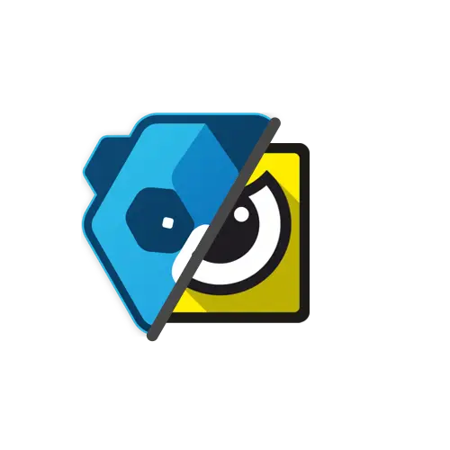

<div align="center"> 

<hr/>



#### Are We Anti-Cheat Yet?

https://areweanticheatyet.com/

<hr/>
</div>


A website dedicated to keeping track of which games have committed to bringing anti-cheat support to GNU/Linux. This project was born out of the fact that I could not find a definite list or source of truth for games that are committing to full GNU/Linux support. So in the spirit of transparency and keeping these companies accountable, I decided to take it upon myself to found this project so that there actually a single place where this information is compiled into a single document, and is a trustworthy and reliable source.

##  RSS-Feed

https://areweanticheatyet.com/feed.rss  

In case you want to follow game updates you can use our RSS-Feed!

## 🎉 Features

- ⌚ Game updates are tracked and viewable in a timeline
- 🤖 Tracks changes since you've last visited the page
- 🛑 Partially supports no-javascript
- 📊 Overview & Breakdown
- 👀 Customizable Design
- 🌙 Dark & Light Theme

## 👍 I'd like to contribute to the list!

First, make sure that the game you'd like to add isn't actually on the list. In the event that it isn't, **make sure there isn't an issue for it already**, and then file a new issue and follow the template and fill out all the required fields.

## 📖 How does this work?

A list is maintained in [games.json](games.json).  
On a new commit, the website is automatically statically regenerated.

## 🫶 Credits

- **Information** and **Updates**: [The Community](https://github.com/Starz0r/AreWeAntiCheatYet/issues)
- All **Banners** and **Logos**: [SteamGridDB](https://www.steamgriddb.com/)
- Creator: [Starz0r](https://github.com/Starz0r)
- <sup><sub>Re-Design & Maintainer: [Curve](https://github.com/Curve)</sub></sup>

## 👷 Build Setup

```bash
# install dependencies
$ yarn

# serve with hot reload at localhost:3000
$ yarn dev

# build for production and launch server
$ yarn build
$ yarn start

# generate static site
$ yarn export
```